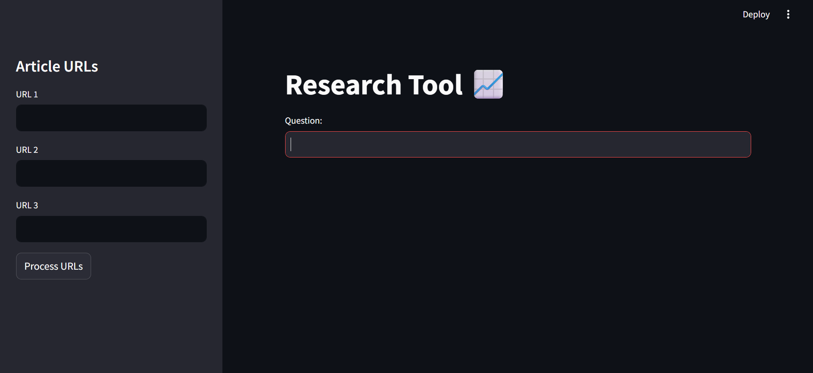

# Research Tool 📈

A Streamlit-based **research assistant** powered by **Large Language Models (LLMs)** and **Generative AI**.  
This tool allows you to provide article URLs, automatically retrieves and processes their content,  
and builds semantic embeddings using **Google Gemini Pro** with **FAISS** as a vector database.  

You can then ask natural language questions, and the app will generate context-aware answers along with the relevant sources — turning raw articles into actionable insights.

---

## 📷 Preview



---

## ✨ Features

- Input up to **3 article URLs** from the sidebar.
- Content automatically fetched and processed with `UnstructuredURLLoader`.
- Splits text into chunks using `RecursiveCharacterTextSplitter`.
- Embeds documents with **Google Generative AI Embeddings**.
- Stores vectors locally using **FAISS**.
- Ask a question and get contextual answers with sources powered by **LangChain** and **Gemini Pro**.

---

## ⚙️ Installation

Clone the repository:

```bash
git clone https://github.com/anshsuthar07/research-tool.git
cd research-tool
```

---

## Create a virtual environment and install dependencies
```
python -m venv venv
source venv/bin/activate   # On Linux/Mac
venv\Scripts\activate      # On Windows
pip install -r requirements.txt
```
---

## Environment Variables

This app requires a Google API key for Gemini.
Create a .env file in the project root and add:

```env
GOOGLE_API_KEY=your_api_key_here
```

---

## Run the Streamlit app:

``` bash
streamlit run app.py
```

---

## Project Structure
```
.
├── app.py                # Main Streamlit app
├── picture.png           # Screenshot of the app
├── requirements.txt      # Python dependencies
├── .env                  # API key (not pushed to GitHub)
├── faiss_index_gemini/   # Local FAISS vector store
└── README.md             # Documentation
```


